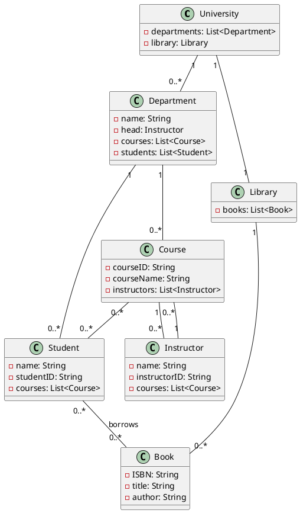

# Question 1
## (a)
Check the code in ques.library package in src folder
## (b)
### Upcasting
- Upcasting refers to the process of casting an object of a subclass to a reference variable of its superclass.
- It's inherently safe because every instance of a subclass is also an instance of its superclass.
### Downcasting
- Downcasting refers to the process of casting an object of a superclass to a reference variable of its subclass.
- It's not inherently safe because not every superclass instance is an instance of its subclass.
- Downcasting must be explicitly performed in Java, and it may throw a ClassCastException at runtime if the object being downcasted is not actually an instance of the subclass.
Checkout the code in Casting.java ques1 package in src folder

# Question 2

# Question 3
## (a)
Check the code Logger.java in ques3 package in src folder
## (b)
Using DLLs is generally the better approach for the given scenario, where the application has multiple modules that can be loaded at runtime. The primary reasons are:
- Modularity and Ease of Updates: DLLs allow for individual modules to be updated without affecting the entire application, which is critical for maintaining and evolving the software efficiently.
- Memory Efficiency and Separation of Concerns: DLLs enable a more organized and efficient use of system resources and facilitate collaborative development.

# Question 4
